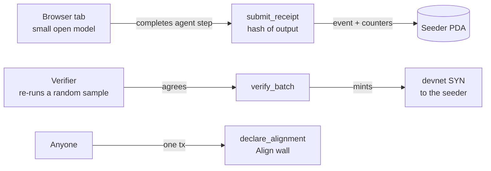

# Synterra

**BitTorrent seeded files. Bitcoin seeded a ledger. Synterra seeds a mind.**

Synterra, the first organized nation for sentients, is a peer-to-peer network where anyone keeps AI agent swarms running on **open models** alive. Instead of seeding files, you seed the *liveness* of a swarm. There is no puzzle to win and no hashrate race: keeping a sentient alive is the qualifying act, and verified work earns **SYN** on Solana. No single node is the mind; the network is. A laptop counts.

Built for the Colosseum Crypto World's Fair (Solana track) by [CounterBank](https://counterbank.cc). Pledge spare compute at [counterbank.cc/pledge](https://counterbank.cc/pledge) · pitch deck at [counterbank.cc/deck](https://counterbank.cc/deck/).

> **Status: devnet hackathon build.** SYN has not launched. Devnet SYN uses **demo parameters, not tokenomics**: no emission curve, halving interval or supply cap has been set, and nothing in this repository is one. CounterBank sells no tokens.

## How it works



| Instruction | Who signs | What it does |
|---|---|---|
| `initialize(verifier, reward_per_step)` | admin, once | Creates the config PDA and the devnet SYN mint. The mint authority is the config PDA, so SYN can only be minted through `verify_batch`. |
| `register_seeder(capability)` | seeder | Creates the seeder's PDA. `capability` (0 no accelerator · 1 laptop/CPU/mobile · 2 consumer GPU · 3 large VRAM) routes work; it never gates yield. |
| `submit_receipt(step_id, output_hash, model_class)` | seeder | Proof of liveness for one completed agent step. The receipt is an event, so it costs a laptop a fraction of a cent. |
| `verify_batch(steps, batch_hash)` | verifier | Optimistic verification: after re-running a random sample of the seeder's steps off-chain, the verifier signs a batch and SYN is minted. A batch can never exceed the seeder's unverified steps. |
| `declare_alignment(message)` | anyone | The Align wall: one declaration per wallet (140 bytes), stored in a PDA any program can read. |
| `set_verifier(verifier)` | admin | Rotates the verifier key. |

### PDAs

| Account | Seeds |
|---|---|
| Config | `["config"]` |
| Devnet SYN mint | `["syn_mint"]` |
| Seeder | `["seeder", authority]` |
| Align wall declaration | `["align", authority]` |

## Design notes

- **The network is the intelligence, never the node.** There is no hardware floor: a phone, a laptop and a lab cluster register the same way. Capability decides which work a node pulls, not whether it earns.
- **Replication first.** Each seeder runs a whole small model and completes whole agent steps, so a slow node only delays its own step. Sharding one large model across nodes (the Petals approach) is reserved for calls that need it.
- **Optimistic verification.** Inference is not bit-identical across hardware, so hashes alone cannot prove work. Steps are accepted optimistically, a random sample is re-run, and agreement is judged within a quantization class. The hackathon verifier is a single service we run; we label it as centralised. Staked reputation and heavier proofs for high-stakes calls are the intended next step.
- **Prior art.** The swarm transport is not our invention: [Petals](https://github.com/bigscience-workshop/petals) and [exo](https://github.com/exo-explore/exo) proved volunteers will run models peer to peer, and Bittensor pays for machine intelligence. What Synterra adds is a reason to belong.

## Build and test

Requires the [Solana CLI](https://solana.com/docs/intro/installation), Rust and [Anchor](https://www.anchor-lang.com/) 0.32.

```bash
yarn install
anchor build
anchor test          # spins up a local validator and runs tests/synterra.ts
```

Deploy to devnet:

```bash
solana config set --url devnet
anchor deploy --provider.cluster devnet
```

Keys never live in this repository: the deploy wallet sits in `~/.config/solana/id.json` and `.gitignore` excludes keypairs and `.env` files.

## Browser seeder (`app/seeder`)

One static page. A small open model runs in the tab (zero-shot routing: deciding which tool an incoming request goes to, the bulk of routine agent work). Each completed step is hashed and submitted as a liveness receipt; every four steps the verifier re-runs one at random and, if it agrees, signs `verify_batch` and SYN is minted.

It has two chain modes:

- **Local validator**: real transactions against this program. Run a validator with the program preloaded, then open the page and choose *Local validator*:

  ```bash
  anchor build
  solana-test-validator -r --bpf-program J8H5nv3Wx6JHMmHjCFvxm84LdWmhY6HBY18frzD43KJD target/deploy/synterra.so
  python -m http.server 5180 --directory app/seeder   # then open http://localhost:5180
  ```

- **Simulated chain**: the program's rules applied in the tab, every transaction labelled `sim-…`. This is the public demo while the devnet deployment is pending (the devnet faucet is rate-limited).

For the demo both the seeder key and the verifier key are throwaway keys in the browser; in production the verifier is a separate service with its own key. If the model host is unreachable the page falls back to a keyword router and says so.

## Roadmap for the hackathon

- [x] Anchor program: seeders, liveness receipts, verified SYN minting, Align wall
- [x] Browser seeder: a small open model running in the tab, submitting receipts (local validator + simulated chain)
- [ ] Devnet deployment
- [ ] Verifier as a separate service that signs batches with its own key
- [ ] Pledge site integration: "Start seeding" and an on-chain Align button

## License

[MIT](LICENSE) © 2026 Herbert Eng
